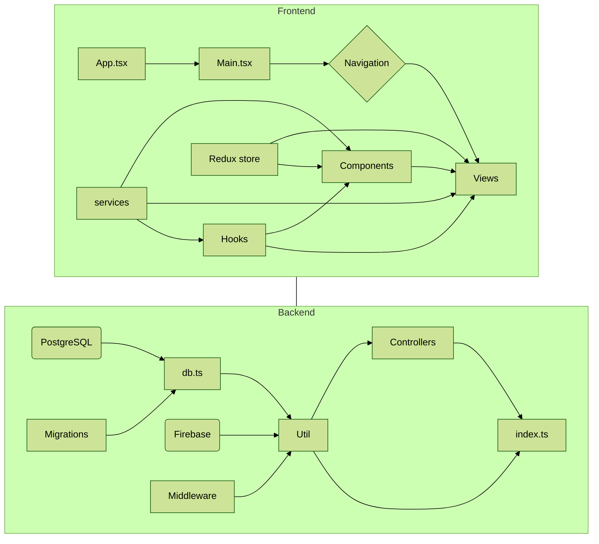

<h2>Overview</h2>
<a href="https://www.youtube.com/watch?v=bIdBKF1wvfM">Click to see a demo video</a>
  

**The goal of the project** was to make a React Native application that has the functionalities required to operate a second hand market. As a little twist I also added some functionalities better known from social media apps such as the possibility to follow other users. The main goal of this project was however to get better at React / React Native, ExpressJS and SQL. The login / registration functionality is made with Firebase and the images are also stored in Firebase.
  

**Both the Backend and the Frontend are fully made with TypeScript** using very strict settings for maximal learning experience. The types are shared between the Backend and the Frontend to make everything convenient. After all, a response body sent from the Backend is the same shape as a response body received in the Frontend.

<h2>Deployment</h2>

1. Create a new Heroku app with PostgreSQL addon and add a new git repository to the back folder with "git init".
2. Add the Heroku remote to the local repository with "heroku git:remote -a appname".
3. Add environment variables required in back/util/config.ts to your Heroku app. 
4. Run the deploy script from backend.
5. Change axios baseURL in front/src/util/axiosInstance.ts to the newly deployed backend's url.
6. Build frontend by running eas build.

<h2>Technologies</h2>

* **TypeScript**
* **React Native**
* **ExpressJS**
* **PostgreSQL**
* **Sequelize**
* **Firebase**
* **Redux**

<h2>Structure</h2>

<h2>Working hours</h2>

&nbsp;
qwdqwdwq
| Tasks | Time used |
| ------------- | ------------- |
| Initialized an Expo app with TypeScript and ESLint. | 3 hours |
| Added a very basic profile page to frontend. | 2 hours |
| Added an Express backend with ESlint and TypeScript. | 2 hours |
| Added a login system to backend and an endpoint for image uploads to Amazon AWS. Started making a new form for posts to frontend. | 6 hours |
| Continued making the form for adding new posts. | 2 hours |
| Completed making the form for adding posts and started typing the project. Configured ESLint as a formatter and changed a few rules. | 12 hours |
| Added custom types for the backend and continues typing it. Started making the frontpage for the frontend. | 6 hours |
| Changed the image upload to S3 to a newer library. Started making the front page and made a login page for the frontend. Added more types to frontend and backend. | 8 hours |
| Extended post form fields, added registration and custom passwords for users, made a single page for unique posts, created a hook for using asyncstorage and login. | 8 hours |
| Added Redux for token managing, created public and private profile page with a possibility to delete your own posts, added custom types to Redux, added a single post view. | 10 hours |
| Fixed more TypeScript stuff. Added error handling to backend and frontend. | 6 hours |
| Started making masonry list for the front page, added new post fields to db and expanded the post form. | 12 hours |
| You don't wanna know. | 15 hours |
| Updated the schemas in the backend by adding a lot of new stuff. | 12 hours |
| Started making masonry list for the front page, added new post fields to db and expanded the post form. | 12 hours |
| Added favorites view and a function for adding favorites, fixed bugs. | 12 hours |
| Integrated Firebase authentication, added profile photos to users. Also took a lot of time to change from CommonJS to ESM so I could use the GOT library in the backend. | 16 hours |
| Changed react router native to react native navigation and added a bottom nav bar. | 10 hours |
| Added a view for editing your profile. Migrated from using S3 to Firebase storage. | 8 hours |
| Started making a websocket server for real time chat. | 4 hours |
| Completed the chat logic that uses web sockets and the database for saving messages and chats. | 15 hours |
| Restructured the backend, initialized followers and more... | 13 hours |
| Started retyping the whole project so I could share types between backend and frontend. Almost done. | 8 hours |
| Continued making the types shared between backend and frontend. Had to configure metro and babel configs to do it which took a long time. Also made some progress on adding following function. | 20 hours |
| Restructured categories in the backend, made a custom category picker modal component and started making the search view for searching posts. | 20 hours |
| Added support for sending image messages. Implemented search further. | 30 hours |
| Finished chat. Started polishing the app and cleaning up all the code. Spent a lot of time getting the "next" button on forms to work and probably did a bunch of other stuff too. | 40 hours |
| Changed the structure of archived chats in the backend, made an email verification system with firebase and fixed bugs. | 13 hours |
| Finalized everything | 50 hours |
| Learn git rebase by rebasing the whole history | 5 hours |
| Fix more things such as updating the chats on new messages and change deployment to Heroku. | 15 hours |

**Total: 368 hours**

plus many more additional hours on stupid mistakes...